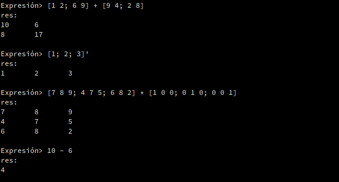
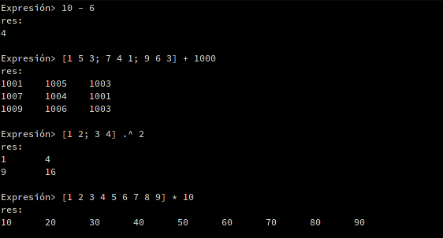
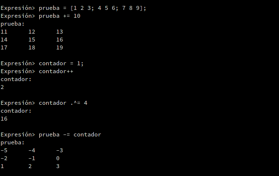
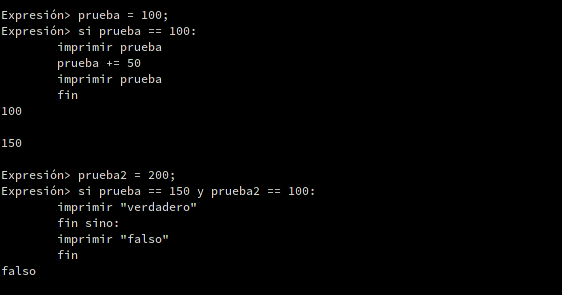
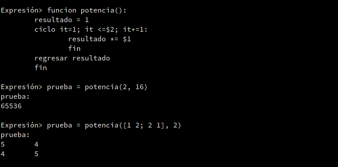
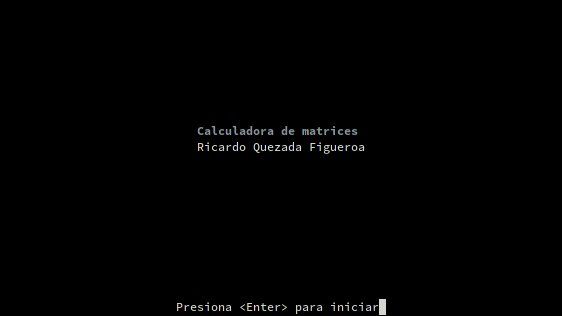

# Calculadora de matrices #

Construcción de lenguaje de programación alrededor de operaciones con matrices.

La construcción se basa en el programa *hoc* presentado en el libro 
**The Unix Programming Enviroment** de *Brian W. Kernighan* y *Rob Pike*, en
el cual se comienza con una simple calculadora y se van agregando características
hasta obtener un lenguaje de programación. En este programa se hizo lo mismo
pero alrededor de operaciones con matrices.

## Características ##

### Operaciones básicas sobre matrices ###

* Suma, resta, multiplicación, potencia, transpuesta.

	
	Muestra de operaciones entre matrices. El apóstrofe se utiliza para
	transponer una matriz.

* Con escalares: suma, resta, multiplicación, división, potencia.

	
	Muestra de operaciones de matrices con escalares.

### Tabla de símbolos ###

* Variables y constantes predefinidas.

	
	Uso de variables. Si no hay ninguna asignación, el resultado de una
	expresión se guarda en *res*.

* Operadores de asignación.

	
	Muestra de suma y asignación en un solo paso. Muestra de operadores de
	incremento y decremento.

### Funciones de cómputo ###

* Decisiones.

	
	Muestra de estructura *si* y de operaciones lógicas. También se muestra la
	directiva *imprimir* y cierta funcionalidad con cadenas.

* Repeticiones.

	
	Control de flujo *mientras* (equivalente a *while*).

	
	Control de flujo *ciclo* (equivalente a *for*).

* Funciones.

	
	Muestra de definición de funciones.

### Otras ###

* Intérprete con *ncurses*.

	
	Mensaje de inicio

	Mediante las funciones de *ncurses* se hacen operaciones sobre la entrada
	para definir una funcionalidad parecida a la de cualquier intérprete:
	Navegación por historial de entrada con flecha-arriba y flecha-abajo;
	navegación por línea actual con flecha-izquierda y flecha-derecha.

* Uso de *gmp* para operaciones con números grandes.

	
	Muestra de operaciones con números grandes. También se muestra la definición
	de funciones recursivas.

## Dependencias ##

* gcc 7.1.1
* bison 3.0.4
* flex 2.6.4
* ncurses 6.0
* gmp 6.1.2

*Versiones en las que ha sido probado. Puede que funcione con versiones anteriores.*
